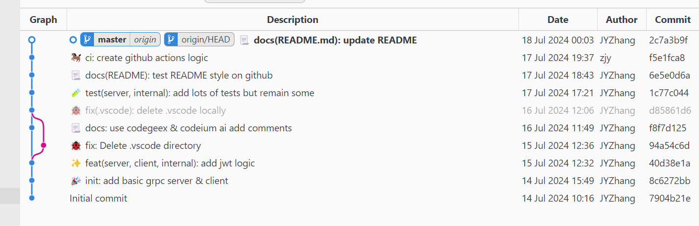

# Git 学习路线和工具调研
Git多重要也是不用多说了, 版本控制必备, 而且也是老老老工具了, 而本废柴由于本来就没有很熟再加上考研, 早已忘了个七七八八, 因此现在也是赶紧找补一下

对老工具(且官方文档太多了看不了一点)的学习我现在比较倾向于培训机构的课程(是从一个很厉害的朋友身上get的观点), 相反对新知识的学习我只看官方文档(一如既往的坚定), 前途一片光明啊(bushi)

基于以上观点, 我在一天左右的时间里学习了以下内容


## 1. Git 理论知识和基本指令

这部分当然是以培训机构为主啦, 最大的编程培训机构相信大家都知道是哪家, 我把尚硅谷近年的两个 git 课程目录都看了看(因为三年前看过其中一个, 因此有对比的想法), 发现两次课的讲师不同, 还真让我对比出了东西

1. 尚硅谷 2021 的 [git教程](https://www.bilibili.com/video/BV1vy4y1s7k6) 我认为是理论的天花板, 除了基础的指令还把团队内协作(项目怎么拉别人一起)和跨团队协作(pr)讲的很清楚, 也包括 .git 文件夹的内容(即 git 的底层原理), 不过 gitee 和 gitlab 相关的真没啥必要看

2. 尚硅谷的新视频理论部分我感觉完全不如2021版的, 但是讲了一个新工具, 链接和细节在下一条里细说

## 2. Git 图形化工具

除了在命令行中敲 `git push` 等基本指令外, 现在也有很多图形化的桌面应用和IDE插件方便开发, 个人认为作为 modern 的程序员使用图形化的产品开发也是很好的

### 2.1. 桌面应用

1. Github Desktop

Github Desktop 在尚硅谷的[新视频](https://www.bilibili.com/video/BV1wm4y1z7Dg)里有讲, 我认为这个软件颜值很高, 把简单的功能做的很好, 但是功能不多

### 2.2. IDE插件
1. Vscode Gitlens

[Gitlens](https://marketplace.visualstudio.com/items?itemName=eamodio.gitlens) 是一个 *Git all in one* 的插件, 个人认为很好用, 例如每一行代码都可以显示谁在什么时间写的(头像都给你展示出来), 非常的 rich information, 内置的 start here 和官方录的[短宣传视频](https://www.youtube.com/watch?v=UQPb73Zz9qk)也很简单明了, 且集成了 blame | graph 等很多功能, 但是有些功能如绘制提交图像要收费, 不过在插件市场上搜也有 Git Graph 等低替或平替插件, vscode 重度使用者建议都下一遍

2. Git Graph
根据你的提交和分支信息绘制图像, 如下, 个人感觉没有Gitlens的绘图美观, 但是它免费呀~



## 3. Git Commit Message的编写规范
经常逛 github 就会发现, `git commit -m message` 的 messgae 其实是有一定规范的

我参考[这篇文章](https://drylint.com/Git/git-commit%E8%A7%84%E8%8C%83.html), 但是它的代码块格式有点问题, 实际上应该想表达的是这段内容:
```html
<type>(<scope>): <subject>
<空行>
<body>
<空行>
<footer>
```

我参考了很多超大型仓库(甚至包括 go 语言的仓库), `<type>(<scope>): <subject>`是最常用的 commit 格式, 其他的部分用的很少

而每次都手写这些 commit message 很容易格式出错, 因此我找了一个 [vscode 插件](https://marketplace.visualstudio.com/items?itemName=redjue.git-commit-plugin), 它可以帮我们生成格式化的 message, 而且有好看的小表情, 非常好用, `1.2. Git Graph` 配图中的 commit message 就是我用这个插件编写的

