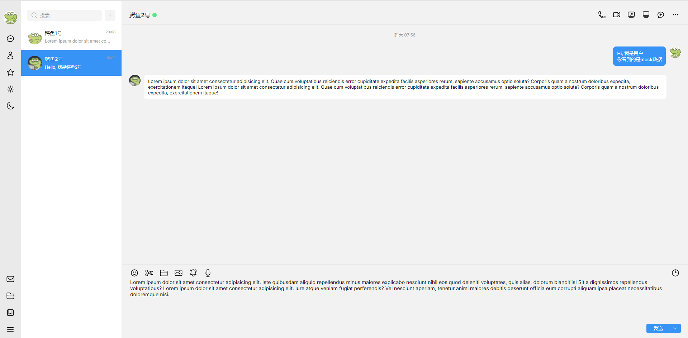

# QQ桌面端聊天界面模仿

一直以来 CSS 都是我的一大心魔, 最近终于是集中学习了一段时间(参考[学习路线](../学习路线.md))攻克了CSS, 并决定复刻 QQ 前端来sharpen my skills

首先, 放上仓库地址: https://github.com/zjy-dev/qq-desktop-mock

效果预览图:


本项目只包含 HTML 和 Sass(一种 CSS 预编译器) 代码, **没有任何 JS 功能!!!**

**仅用于学习目的!!!**

项目README中有目录组织和 Sass 编译指令等信息, 因此本文主要介绍逻辑上的设计

## 整体布局

整体使用网格布局, 使用 grid-templete 来划分区域以最大化可读性
```scss
// scss/style.scss 

grid-template-areas:
    "nav search      menu "
    "nav chat_option main ";
```

结合预览图来看, 可以很容易的发现
1. 最左侧是nav导航栏
2. 从左到右第二栏是搜索框search和选择联系人的chat_option
3. 而右上方的是menu菜单
4. 右下方则是本页面最主要的main区域用来展示聊天消息和处理用户输入

## 各个分区的布局逻辑

Cooking中...