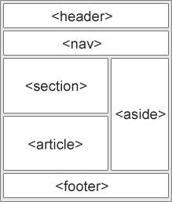

# 前端学习路线

最近一个月每天都在抽空学习前端, 记录一下学习路线, 如果你也打算入门学习前端, **强烈建议**看一下我的路线 

## 1. HTML5

对简单的HTML没有太多想记录的, 任何教程都可以让你轻松学会

我推荐[千锋Kerwin老师](https://www.bilibili.com/video/BV1r64y1T7J8/)的视频, 我认为看视频速通即可, 至于练手? 学CSS的时候综合去练就行

唯独一个语义化标签想要说几句
 

这张图里大部分元素的职责都非常清晰了, 我认为不清晰的只有 `<section>` 和 `<artical>` 需要加以区分, 我参考[w3schools](https://www.w3schools.com/html/html5_semantic_elements.asp)的教程, 把 section & artical 的定义和 `Nesting <article> in <section> or Vice Versa?` 小节看一下就好了, 大致意思是说

此外, 一个网页最多只能有一个`<main>`标签, 用来标记本网页的主要部分, 其实和`<section>`是差不多的, 相当于本网页中最主要的一个`<section>`

## 2. CSS3

CSS是前端的重头戏之一了, 我个人感觉它的繁杂程度比起JavaScript是有过之无不及(之前大二学的时候就被劝退过), 必须要大量练习(每一个知识点都要去练), 知行合一才能学的明白

但是CSS的特点是难度较低, 只要找好资源 + 规划好进度, 学好CSS也只是时间问题, 我推荐的资源:

- 知识点方面我仍然推荐[千锋Kerwin老师](https://www.bilibili.com/video/BV1r64y1T7J8?t=0.9&p=27), 国内培训机构在讲知识点方面还是非常强的
- 练手项目我**强烈**推荐[Jonas的课程](https://www.bilibili.com/video/BV1A34y1e7wL?t=1.5), 外国的项目教程一般都很擅长让你充分利用学过的知识点

以上两个教程只需看相应的部分即可, 并不需要全部看完

无论知识点还是项目, 重点一定是 **盒子模型**, **Flex弹性盒布局** 和 **grid网格布局** 部分

不过前端难的部分不光是技术, 设计也同样重要, 不会设计的话当你需要独立做项目时, 很容易会发现学到的编程技术用不出来

但设计的学习我认为不能着急, 囫囵吞枣是学不会的, Jonas 的课程后半部分就是专门教你如何公式化的设计网页的, 强烈推荐有时间慢慢观看(而不是一次看完)!!!

之后, 强烈建议去学一手Sass(用来模块化CSS的), [官方文档](https://sass-lang.com/guide/)一共就一页, 自学即可

跟着别人做项目毕竟只是在复读, 有输入没输出, 因此在学完以上内容之后, 我推荐自己设计一个网页来进行最终的练习, 或者直接复现现有的网页(总之是要锻炼 **设计稿 --> 代码** 的能力)

我选择复刻每天盯着看的QQ Desktop的前端来练手, 布局方面采用网格布局和弹性盒布局的现代布局方案, 并使用Sass来模块化CSS代码, 仓库在[这里](https://github.com/zjy-dev/qq-desktop-mock), **仅供学习交流目的!!!**

## 3. JavaScript

Cooking中...
<!-- TODO -->

