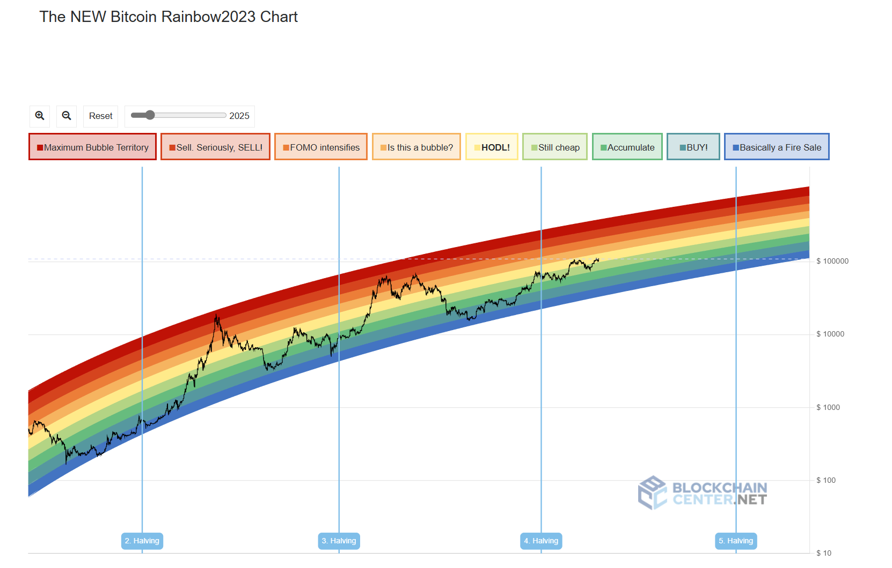

# 🌈 比特币彩虹图

## 简介

比特币彩虹图(Bitcoin Rainbow Chart)是加密货币市场中最著名的趋势分析工具之一，它通过彩虹色带的方式直观地指示我们进行抄底和逃顶，同时也可以结合市场情绪和牛熊周期去预测价格。

彩虹图最基本的思路就是用一个对数函数去拟合币价，非常简单直接。

## 看懂彩虹图

首先，**彩虹图在线网站**: [www.blockchaincenter.net](https://www.blockchaincenter.net/en/bitcoin-rainbow-chart/) 是目前最权威的比特币彩虹图平台, 在谷歌上的 SEO 也排名第一。

往下划到 `The NEW Bitcoin Rainbow2023 Chart`，可以看到最新的彩虹图。

每个色彩都有批注，总体来看，越暖色，越红就代表着越该逃顶。越冷色，越蓝就越应该抄底。详细展开：

- 倒数第一第二区间（蓝色）代表着适合**大额买入**
- 倒数第三区间是 **DCA 定投区间**
- 中间的黄色区间就是对数函数本身，也是一个不上不下的 hold 的区间，卖了容易踏空，买了容易被套
- 按照上个周期的数据，接下来的牛市我们**很难触及第一第二的红色逃顶区间**。所以**价格触及第三区间后，我们也许就应该开启定抛！！！**

## 历史

> 本小节总结自彩虹图网站运营者的[博文](https://www.blockchaincenter.net/en/history-of-the-rainbow-chart/)！

这一指标从 2014 年的一个社区 meme 演变为今天广受关注的市场分析工具，其发展历程充满了传奇色彩。

**Reddit 用户'azop'(2014 年)** 是原始发明者，在 Mt.Gox 崩溃后的熊市中开始发布彩虹图，这个图表对比特币的价格用指数函数进行拟合。很明显，指数函数越涨越快，违背了任何资产的发展规律，包括 BTC。这种拟合长期来看必然失效。

**Bitcointalk 用户'trolololo'(2014 年)** 使用对数函数 `y=2.9065ln(x)-19.493` 建模比特币价格。这是**最重要**的原始图表，因为对数显然更符合资产的发展规律。今天的彩虹图也基于对数函数！

**Rohmeo(2019 年)** 是现代版本的创造者和维护者。他在 2019 年熊市期间重新激活了这一工具，将 trolololo 的公式与彩虹色带结合，创造了具有"弯曲"形状的现代彩虹图，并运营简介中提到的**彩虹图在线网站**: [www.blockchaincenter.net](https://www.blockchaincenter.net/en/bitcoin-rainbow-chart/)。

**Eric Wall 和 Nic Carter(2020 年)** 重新推广了彩虹图，Eric 在 2020 年 4 月发推特"Buy Bitcoin"配合彩虹图，成为爆款推文（成功预测了市场），将彩虹图带入新一代投资者视野。

### 对 PlanB 的批判（一个有趣的故事）

话说有个神秘的荷兰银行大佬，Twitter 账号叫[@100trillionusd](https://twitter.com/100trillionUSD)，化名**PlanB**。这哥们在 2019 年（注意，就在彩虹图之后！）突然蹦出来，声称自己发明了一个"科学"的比特币价格预测模型——**Stock-to-Flow 模型**。

这个模型基于"存量流量比"理论，听起来很高大上对吧？PlanB 还甩出各种专业术语比如"协整"、"高 R 平方值"等等，瞬间征服了一众比特币信徒。他到处上播客，各大银行纷纷引用他的研究，短短几个月就获得了百万粉丝！

**关键是，PlanB 坚持认为比特币价格纯粹是供应量的函数**，完全忽视需求这个小细节 🤡。最骚的是他预测 2020 年减半后比特币会达到 10 万美元...结果大家都知道了。

Eric Wall 直接用彩虹图来嘲讽 Stock-to-Flow 模型，成为币圈经典名场面。

## 彩虹图的演进

2022 年比特币价格跌破 2 万美元，首次突破彩虹图底部区间。Rohmeo 最初想让图表"有尊严地死去"，但最终在粉丝要求下妥协在底部添加了"靛蓝色"区间。但加了该区间的几周后，币价再次跌破了彩虹图。

**2022 年 11 月，Rohmeo 发布了彩虹图 V2 版本**，基于截至 2022 年的完整数据重新拟合，新模型更加保守且解释了迄今为止的每次价格波动。

## 2025 年市场预测

根据最新的彩虹图 V2 版本和历史牛熊规律（[这个项目](https://github.com/zjy-dev/btc-cycle-compare)直观的对比了历史周期），**预计 2025 年 10 月为本轮牛市高点**。如果美联储降息顺利，10 月**大概率能上探第三区间(橙色"FOMO 加剧"区间)，目标价格约 18-23 万美元**。

---

_数据来源：[blockchaincenter.net](https://www.blockchaincenter.net/en/bitcoin-rainbow-chart/)_  
_风险提示：本文不构成投资建议，加密货币投资存在重大风险_
