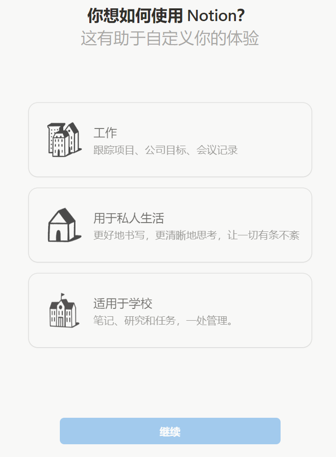
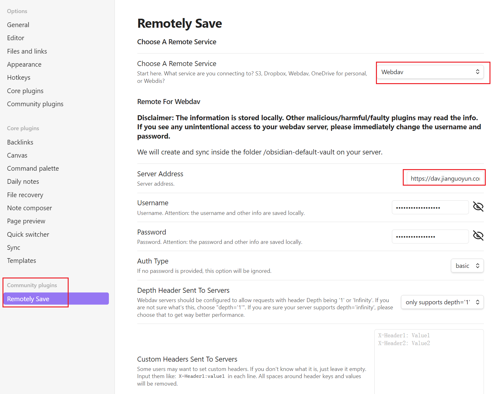
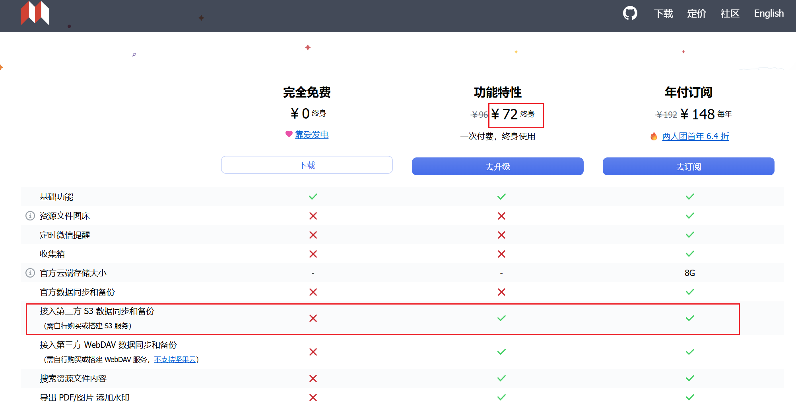

# 笔记软件调研

工具的调研就是主打一个**大白话**, 把使用体验说清楚, 对比明白就完事

时至今日, 世界上最火热的笔记软件无疑是 **Notion** 和 **Obsidian** 了, 当然中文区还有一个**思源笔记**对标 Obsidian

先说**结论**, 我**认为 Notion 和 Obsidian 不应该是竞争关系而应该是互补关系!!!**

- Notion 在计划制定方面因为其**交互性和丰富度**而非常强大
- 而 Obsidian 作为 Markdown 产品在**记录学习笔记, 制作知识库**方面因为其**简洁性**具有天然优势, 再加上**双链 知识图谱**等功能, 真的是为知识而生.

接下来带着我的拙见, 让我们来盘点一下这三款 🔥**world's best note softwares**🔥!!

## 1. Notion

[Notion](https://www.notion.com/) 就是传说中的**地球 Online** 神器, 官方一直在宣传的就是从 **personal**、**academic**、**work** 三个维度全方位征服地球 bushi)

国内学生可以[免费申请 Notion Plus](https://www.notion.com/help/notion-for-education), 可以存无限的文件, 存无限的表格等...

- **功能丰富度**远超 markdown, **开箱即用**无需折腾, 数据库、看板、日历、公式应有尽有, **交互性**极强
- **规划学业、人生**和**团队协作**是强项, 真的可以地球 online 从入门玩到毕业
- **模板生态**极其丰富, 从个人规划到企业管理啥都有, 每年网上都会有一批 notion templetes 202x🔥
- **跨平台**体验一致, 免费同步, 而且网页版就很好用
- 最近一直在发展 Notion AI 生态, 可以用 AI 搜索/总结仓库里的内容等, 学生可以半价购买该服务, 但是感觉不太值
- 缺点是使用门槛高, 需要去 youtube 看半小时以上的教学视频才能 master 基本玩法

## 2. Obsidian

[Obsidian](https://obsidian.md/) 是**顶配硬核 markdown 产品**, 专门为做笔记而生

- **双链笔记**的天花板, 知识图谱可视化做得很棒, 适合构建知识体系
- **插件生态**极其丰富, 可以魔改成任何你想要的样子, 折腾党福音
- **本地存储**数据安全, **仓库(vault) 本质就是一个文件夹**, 完全掌控自己的数据
- **Markdown**语法, 简洁明了, 适合快速的学习记录
- 缺点是开箱后比较简陋, 像个"毛坯房", 需要花时间探索插件生态

### 同步方案 (重点!!!)

网上对 Obsidian 一小半的讨论都集中在多设备同步, 实际上如[官网](https://publish.obsidian.md/help-zh/%E5%BF%AB%E9%80%9F%E5%85%A5%E9%97%A8/%E5%90%8C%E6%AD%A5%E7%AC%94%E8%AE%B0)所说, 仓库(vault) 本质就是一个文件夹, 任何能同步一个文件夹的东西都能同步 Obsidian

我实际使用了一些热门的同步方案, 以下是使用体验和氪金建议:

- **谷歌云盘**: 差不多 30 秒能同步, 免费提供 **15G** 空间, 基本完全够用, 后续会出教程具体如何操作
- **坚果云 + remotely save 插件**: 秒同步体验, 免费额度是每月 **3G 上传 + 1G 下载**, 设备间同步有一些配置门槛, 后续会出教程具体操作
  
- **两者可以一起开**, 互不冲突!!! 谷歌云盘兜底, 坚果云日常使用
- **基本不用氪金**, 如果真要氪金千万**别氪官方** (4 刀/月太贵), 氪坚果云会员 (差不多 2.5 刀/月) 更划算
- **git 仓库**: 这个肯定是能用, 而且还有版本控制. 但是有谁乐意对频繁修改的笔记进行版本控制呢... 而且一直要手动运行 git 指令来手动同步, 非常反人类, 不推荐
- **本地设备间同步**: 很快很好用, 本质就是用局域网在设备间同步文件夹. 但对我来说不同设备经常见不到面, 而且我不想用手机做载体存笔记, 如果你的设备都放在一起强烈推荐

## 3. 思源笔记

[思源笔记](https://b3log.org/siyuan/) 国产之光, **中文支持**确实好, 很多中英文符号都是互通的, 但是要付费买同步功能 (x)

- 开箱后功能就比较丰富, 这点比 Obsidian 好很多
- 但是同步功能必须要花钱才能用:
  - **功能特性版**: ¥72 终身买断 ([官网定价](https://b3log.org/siyuan/pricing.html)), 可以用第三方同步
  - **年付订阅**: ¥148/年 (包含官方 8G 云同步)
    
- **插件生态**不如 Obsidian 丰富, 自定义程度有限
- 总体来说功能还在追赶阶段, **不如 Obsidian 成熟**, 且不能白嫖同步, 只推荐给英文非常不好的人

## 4. 总结

**Notion 和 Obsidian/思源不是竞争关系，而是互补关系！理想的搭配是：**

- **Notion**: 负责**规划人生、制定计划、项目管理**等需要交互性和可视化的场景
- **Obsidian/思源**: 负责**日常学习记录、知识积累、构建知识体系**等需要快速记录的场景

**具体推荐：**

- **最佳搭配**: Notion + Obsidian 双剑合璧，各司其职, 还完全免费
- **英语不好**: Notion + 思源笔记，中文友好
